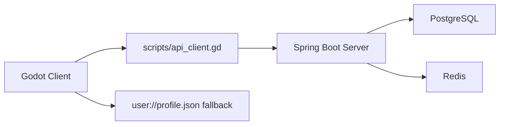
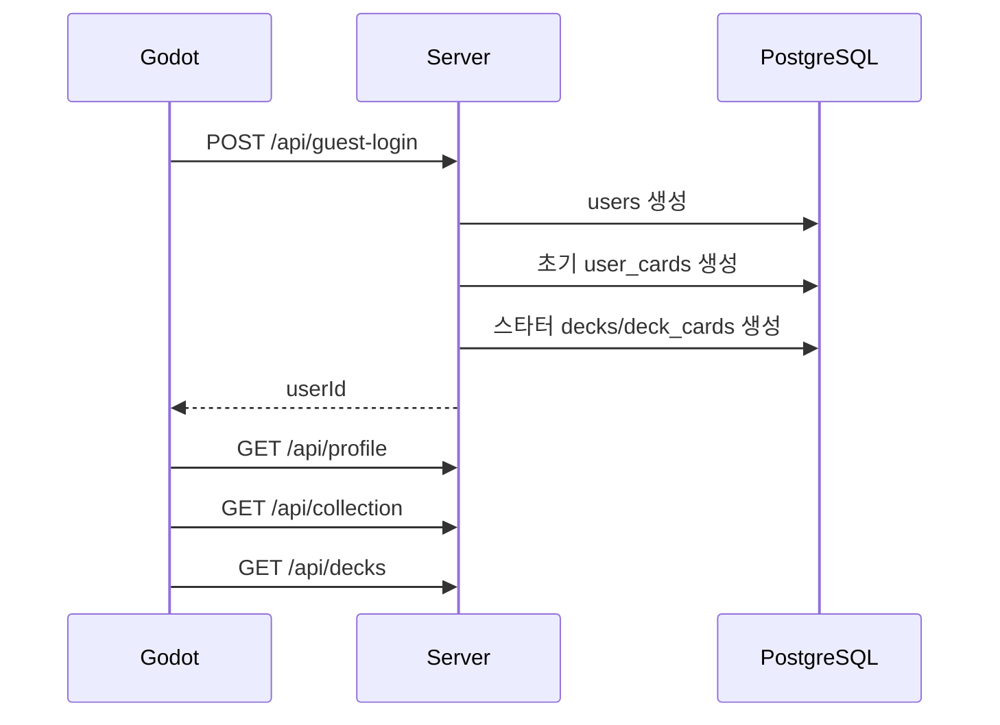
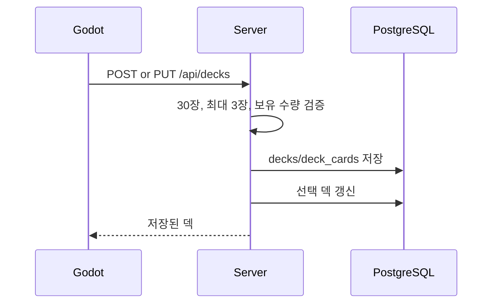
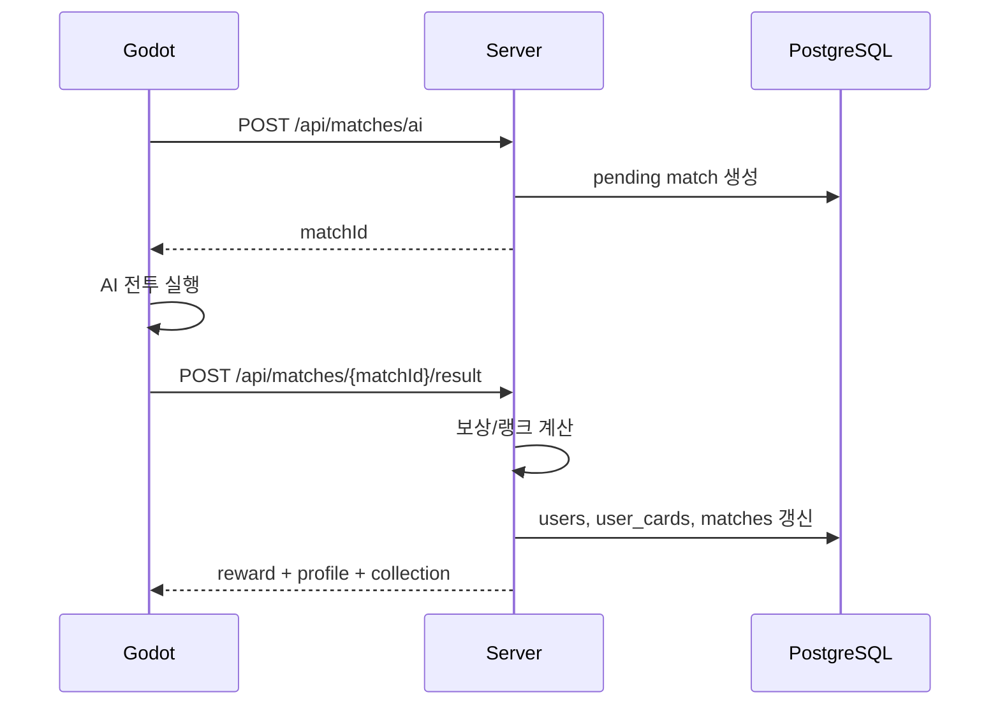
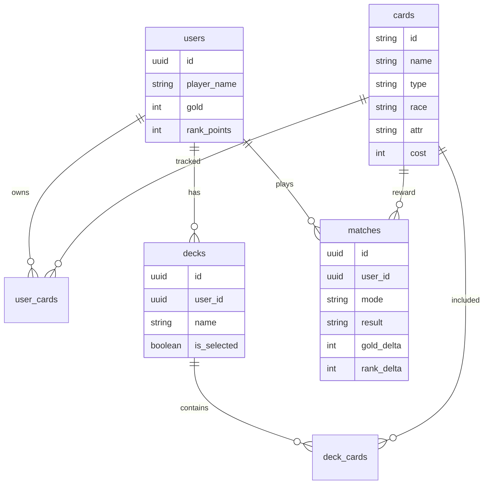

# Card Draft 구조 문서

## 전체 구조



Godot 클라이언트는 서버 연결을 먼저 시도한다. 서버 연결에 실패하면 기존 로컬 저장 방식으로 계속 실행된다.

## 클라이언트 책임

Godot가 담당하는 것:

- 화면 전환.
- 덱 구성 UI.
- 카드 보관함 UI.
- AI 전투 실행.
- 전투 애니메이션.
- 승패 판정.
- 서버 연결 실패 시 로컬 저장 fallback.

주요 파일:

- `scripts/main.gd`: 화면 흐름, 전투 흐름, 서버 동기화 진입점.
- `scripts/api_client.gd`: HTTP API 호출.
- `scripts/card_database.gd`: 로컬 카드 데이터 로드.
- `scripts/profile_store.gd`: 로컬 프로필 저장.
- `scripts/deck_service.gd`: 덱 검증과 요약.
- `scripts/reward_service.gd`: 로컬 fallback 보상 계산.

## 서버 책임

Spring Boot 서버가 담당하는 것:

- 게스트 유저 생성.
- 카드 마스터 데이터 seed.
- 보유 카드 저장.
- 덱 저장과 검증.
- 선택 덱 관리.
- AI 매치 생성 기록.
- 전투 결과에 따른 보상 계산.
- 랭크 점수 계산.

서버가 아직 담당하지 않는 것:

- 실시간 PvP.
- 서버 권위 전투 판정.
- 치팅 방지.
- 정식 로그인.
- 시즌과 MMR.

## 서버 패키지 구조

```text
server/src/main/java/com/carddraft/server
├── api
├── config
├── model
├── repository
└── service
```

역할:

- `api`: REST Controller, DTO, 에러 응답.
- `config`: CORS 같은 웹 설정.
- `model`: API와 저장소에서 쓰는 record 모델.
- `repository`: `JdbcTemplate` 기반 DB 접근.
- `service`: 유스케이스, 덱 검증, 보상 규칙, 카드 seed.

## 데이터 흐름

### 첫 실행



### 덱 저장



### 전투 종료



## DB 구조



## 중요한 설계 결정

- MVP 인증은 게스트 유저 + `X-User-Id` 헤더로 처리한다.
- 서버는 보상과 랭크 계산의 기준이 된다.
- 전투 판정은 아직 Godot가 한다.
- Redis는 실제 PvP 큐가 아니라 AI 매칭 연출 상태 저장 용도다.
- 서버가 꺼져도 Godot 로컬 MVP가 실행되어야 한다.

## 다음 구조 개선

1. 카드 효과 하드코딩 제거.
   - `data/cards.json`에 `effects` 필드 추가.
   - Godot와 서버가 같은 효과 정의를 읽게 만든다.

2. 카드 데이터 단일화.
   - 서버 `GET /api/cards`를 Godot 카드 로더의 우선 소스로 사용.
   - 로컬 JSON은 fallback 데이터로 둔다.

3. 서버 권위 전투 준비.
   - 전투 명령 API 또는 WebSocket 프로토콜 설계.
   - 매 턴 상태 검증.
   - 클라이언트 결과 제출 방식 제거.

4. 실제 PvP.
   - Redis 큐로 일반전 매칭 먼저 구현.
   - 랭크전은 일반전 안정화 후 적용.
